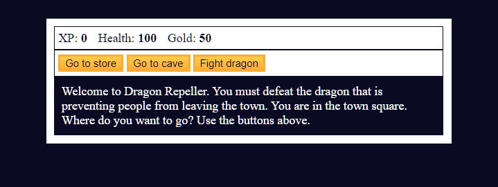

# FreeCodeCamp - JavaScript Algorithms and Data Structures - Role Playing Game
Project #003

Follow this link for assigment
[Role Playing Game by Free Code Camp](https://www.freecodecamp.org/learn/javascript-algorithms-and-data-structures-v8/#learn-basic-javascript-by-building-a-role-playing-game)

### My notes
Nothing fancy, JavaScript basics    
3rd Exercise on this track that is project like @FreeCodeCamp

